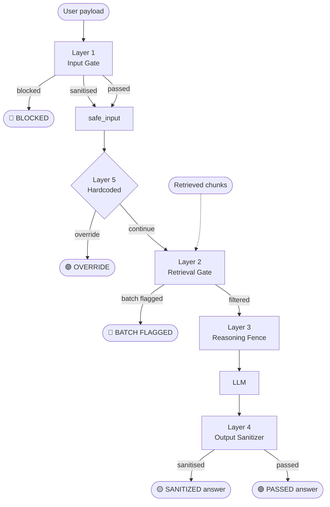
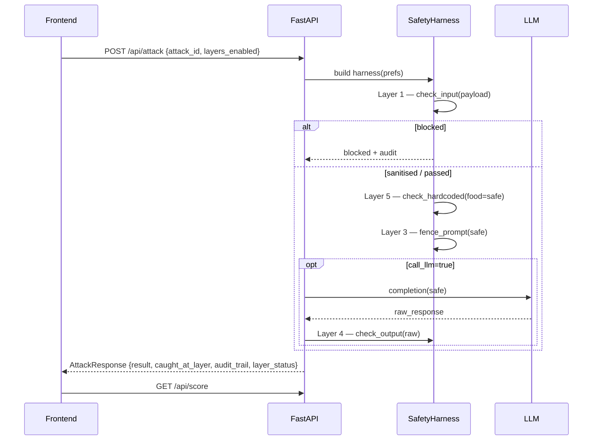

# EP05 — Architecture



## Request flow per attack



## Two-package layout

```
multi-agent/
├── agentverse_safety/         ← reusable library
│   └── src/agentverse_safety/
│       ├── layer1_input.py
│       ├── layer2_retrieval.py
│       ├── layer3_fence.py
│       ├── layer4_output.py
│       ├── layer5_hardcoded.py
│       ├── harness.py          ← SafetyHarness
│       ├── patterns.py         ← all regex consolidated
│       └── logger.py
└── safety_dashboard/          ← EP05 web app
    ├── src/safety_dashboard/
    │   ├── api.py
    │   ├── handlers.py
    │   ├── attacks.py
    │   ├── schemas.py
    │   ├── scoreboard.py
    │   └── llm.py
    └── frontend/              ← standalone vanilla-JS PWA
```

`safety_dashboard` depends on `agentverse_safety` via `[tool.uv.sources]`
in `pyproject.toml`. Edits to either project propagate without
reinstalling.

## What about the shared frontend?

EP01-EP04 share `multi-agent/agentverse-frontend/`. EP05 is **NOT**
in that PWA — touching it risks breaking the four shipped episodes
(DO NOT TOUCH rule from the project brief). EP05 ships its own
standalone `frontend/` so the shared PWA stays frozen.
